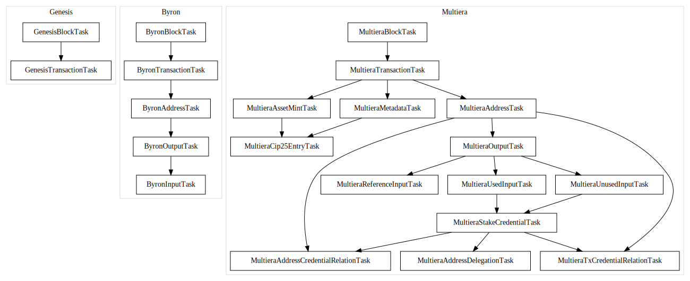

import CodeBlock from "@theme/CodeBlock";
import MyComponentSource from "!!raw-loader!../../../indexer/execution_plans/default.ini";

---

## sidebar_position: 2

# Example Execution Plan

Here is an example of an execution plan. Notably, this is the default plan that will be used

<CodeBlock
  language="ini"
  title="/indexer/execution_plans/default.ini"
  showLineNumbers
>
  {MyComponentSource}
</CodeBlock>

Notably, this execution plan will generate the following execution graph

As you can see from the plan, there are many tasks that will run. Note that:

- Tasks operate at the block level. This means that different block formats have different execution graphs
- Tasks run in parallel based on their dependency graph

Note: we have an open task to improve documentation of existing tasks [here](https://github.com/dcSpark/carp/issues/42)
