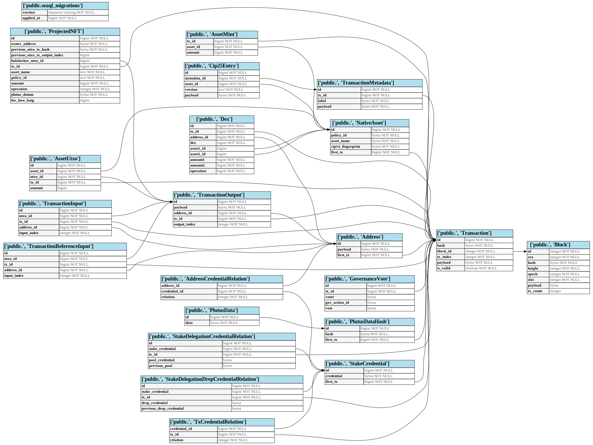

import CodeBlock from "@theme/CodeBlock";
import SqlFile from "!!raw-loader!../../bin/schema.sql";

# SQL Format

Although Carp comes with a webserver and client, users may want to run their own SQL queries.

Here is the table format used by Carp

More concretely, the full SQL schema can be seen below

<CodeBlock language="sql" title="schema.sql" showLineNumbers>
  {SqlFile}
</CodeBlock>

Since Carp contains a lot of binary data, here is a cheatsheet for some common queries:

1. Exact match binary data using `WHERE "Transaction".hash = '\x18565ab3c960c000531e5b359432397907d663c0ac5f5dbae80e1bf88d25c8a0'`
2. Wildcard match binary data using SQL commands such as `like '\x8200'::bytea || '%'`
3. Match a list of options using `"StakeCredential".credential = ANY(array['\x8200581c8baf48931c5187cd59fde553f4e7da2e1a2aa9202ec6e67815cb3f8a']::bytea array)`
